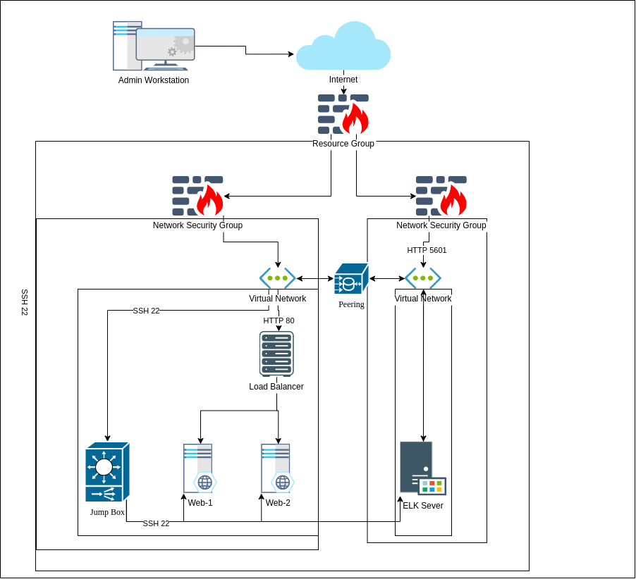

## Automated ELK Stack Deployment

The files in this repository were used to configure the network depicted below.

These files have been tested and used to generate a live ELK deployment on Azure. They can be used to either recreate the entire deployment pictured above. Alternatively, select portions of the yamal files may be used to install only certain pieces of it, such as Filebeat.

  * _TODO: Enter the playbook file._
  * [Ansible Config](ansible.cfg):
    * Requres the proper remote user.
  * [Entire Deployment Setup](main.yml):
    * Requires private IP(s) added to [Hosts](hosts) file
  * [ELK Setup](roles/install-elk/tasks/main.yml):
    * Requires private IP(s) added to [Hosts](hosts) file
  * [Filebeat Setup](roles/install-filebeat/tasks/main.yml)
    * Requires private IP(s) added to [Hosts](hosts) file
    * Requires private IP(s) of ELK in the [Filebeat Configuration](roles/install-filebeat/files/filebeat-config.yml) file
  * [Metricbeat Setup](roles/install-metricbeat/tasks/main.yml)
    * Requires private IP(s) added to [Hosts](hosts) file
    * Requires private IP(s) of ELK in the [Metricbeat Configuration](roles/install-metricbeat/files/metricbeat-config.yml) file

This document contains the following details:
* Description of the Topology
* Access Policies
* ELK Configuration
  * Beats in Use
  * Machines Being Monitored
* How to Use the Ansible Build

### Description of the Topology

The main purpose of this network is to expose a load*balanced and monitored instance of DVWA, the D*mn Vulnerable Web Application.

Load balancing ensures that the application will be highly accessible, in addition to restricting traffic to the network.
* _TODO: What aspect of security do load balancers protect? What is the advantage of a jump box?_
* Load Balancers delegate and route traffic based on server capabilities and connection. This allows for more stability, uptime, and availability incase a server crashes or becomes inaccessible. Example Issue would be DDoS.
* The advantage of a jump box is that it allows the maintainer(s) a secure private backdoor to manage the network and machines

Integrating an ELK server allows users to easily monitor the vulnerable VMs for changes to the internal network and system logs.
* _TODO: What does Filebeat watch for?_
* Filebeat captures log events or other admin specified events and transfers the data to the ELK server.
* _TODO: What does Metricbeat record?_
* Metricbeat collects metrics of activity and transfers the data to the ELK server.

The configuration details of each machine may be found below.
_Note: Use the [Markdown Table Generator](http://www.tablesgenerator.com/markdown_tables) to add/remove values from the table_.

| Name       | Function | IP Address             | Operating System |
|------------|----------|------------------------|------------------|
| Jump Box   | Gateway  | 10.0.0.4/Static_Pub_IP | Linux            |
| Web-1      | Web App  | 10.0.0.7/104.43.220.6  | Linux            |
| Web-2      | Web App  | 10.0.0.6/104.43.220.6  | Linux            |
| Elk-Server | IDS      | 10.1.0.4/Static_Pub_IP | Linux            |

### Access Policies

The machines on the internal network are not exposed to the public Internet. 

Only the jump box machine can accept connections from the Internet. Access to this machine is only allowed from the following IP addresses:
* _TODO: Add whitelisted IP addresses_
* Admin's Host IP through SSH.
* The only machine that excepts connections from the internet is my Host machine, and my public IP.

Machines within the network can only be accessed by _____.
* _TODO: Which machine did you allow to access your ELK VM? What was its IP address?_
* The machine that connects to the ELK server within the network was the Ansible box on the Jump-box-provisioner.

A summary of the access policies in place can be found in the table below.

| Name       | Publicly Accessible | Allowed IP Addresses                                   |
|------------|---------------------|--------------------------------------------------------|
| Jump Box   | Yes                 | Admin_Host_Pub_IP:5601, 10.0.0.6, 10.0.0.7, 10.1.0.4   |
| Web*1      | No                  | 10.0.0.4:22                                            |
| Web*2      | No                  | 10.0.0.4:22                                            |
| Elk*Server | No                  | Admin_Host_Pub_IP:5601, 10.0.0.4:22                    |

### Elk Configuration

Ansible was used to automate configuration of the ELK machine. No configuration was performed manually, which is advantageous because...
* _TODO: What is the main advantage of automating configuration with Ansible?_
* The main advantage of automating configuration is the ability to standardize configurations for any host accross the entire network.

The playbook implements the following tasks:
* Installs docker.io
* Installs python3-pip
* Installs docker (the docker module)
* Implements several ways of increasing and utilizing virtual memory
* Installs sebp/elk:761 ( the elk-stack) and map the proper ports
* Makes sure docker service is running

The following screenshot displays the result of running `docker ps` after successfully configuring the ELK instance.

### Target Machines & Beats
This ELK server is configured to monitor the following machines:
* _TODO: List the IP addresses of the machines you are monitoring_
* 10.0.0.6
* 10.0.0.7

We have installed the following Beats on these machines:
* _TODO: Specify which Beats you successfully installed_
* Filebeat:
    * Installed on both Web*1 and Web-2
* Metricbeat 
    * Installed on both Web*1 and Web-2

These Beats allow us to collect the following information from each machine:
* _TODO: In 1-2 sentences, explain what kind of data each beat collects, and provide 1 example of what you expect to see. E.g., `Winlogbeat` collects Windows logs, which we use to track user logon events, etc._

### Using the Playbook
In order to use the playbook, you will need to have an Ansible control node already configured. Assuming you have such a control node provisioned: 

SSH into the control node and follow the steps below:
* Copy the _____ file to _____.
* Update the _____ file to include...
* Run the playbook, and navigate to ____ to check that the installation worked as expected.

_TODO: Answer the following questions to fill in the blanks:_
* _Which file is the playbook? Where do you copy it?_
* _Which file do you update to make Ansible run the playbook on a specific machine? How do I specify which machine to install the ELK server on versus which to install Filebeat on?_
* _Which URL do you navigate to in order to check that the ELK server is running?

_As a **Bonus**, provide the specific commands the user will need to run to download the playbook, update the files, etc._
